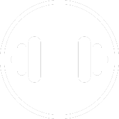

# FitHub Wellness - Interfaz de Usuario

<div align="center">
  
</div>

## Descripción General

FitHub Wellness es una aplicación interactiva diseñada para ayudar a los usuarios a monitorear y gestionar su bienestar general. Esta solución digital se centra en la salud, el ejercicio y el seguimiento personal, permitiendo a los usuarios diseñar y mantener una lista de rutinas ajustadas a sus objetivos personales de salud y actividad física.

## Requisitos del Sistema

Para garantizar un funcionamiento óptimo del frontend de FitHub Wellness, es necesario contar con:

- Vue.js (Framework de JavaScript progresivo)
- Node.js (Entorno de ejecución para JavaScript)
- npm (Gestor de paquetes de Node.js)

## Proceso de Instalación

Para configurar el entorno de desarrollo y las librerías necesarias, siga los pasos a continuación:

1. Clonar el repositorio y acceder al directorio del proyecto:

```bash
cd fithubwellness
```

2. Instalar las dependencias necesarias utilizando npm:

```bash
npm install
```

## Cómo Ejecutar la Aplicación

Una vez instaladas las dependencias, inicie el servidor de desarrollo ejecutando:

```bash
npm run serve
```

Con estos pasos, FitHub Wellness estará corriendo localmente y podrá acceder a él a través de su navegador para comenzar a explorar sus funcionalidades.
